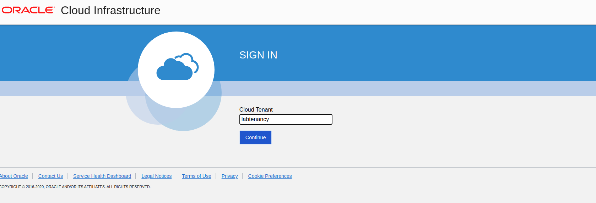
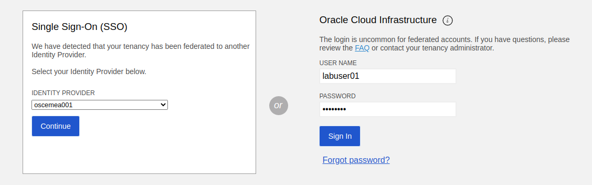

# Coherence on OKE Hands On Lab

## Objective

This lab will demonstrate the steps required to get Oracle Coherence up and running on Oracle Container Engine (OKE) using the Coherence Operator. It will then explore some of the advantages of running Coherence on Kubernetes on OCI. 

## Requirements

Name of the OCI tenancy used to host the lab.

The OCI compartment where your resources will be located.

A username and password for the OCI tenancy used for the lab.

Details of the two Oracle Container Engine (OKE) clusters that will be used for the lab. 

## Login in to the OCI Console

This lab will use two OKE clusters, one in the London region and the other in the Frankfurt region. We will interact with the OKE clusters via standard Kubernetes tools like kubectl and helm. Fortunately OCI provides a [Cloud Shell](https://docs.cloud.oracle.com/en-us/iaas/Content/API/Concepts/cloudshellintro.htm) environment with these tools already installed that we can use as a virtual bastion host. 

To get started locate the OCI username and password assigned to you and open the OCI Console at https://console.uk-london-1.oraclecloud.com/ and enter the tenancy name.



Select Continue and then enter the username and password issued to you on the **right hand side** of the log in screen:



Press sign in.

## Establish Access to Frankfurt Cluster

Switch to the Frankfurt region using the region chooser in the grey bar at the top of the screen. 


Once in the Frankfurt region ensure you are still in the specified compartment. 

We will now configure kubectl in cloud shell to work with the Frankfurt OKE cluster. Click on the "hamburger" icon in the top left to open the services menu and locate "Developer Services" and then the "Kubernetes Clusters".


On the OKE clusters homepage locate the cluster assigned to you. Ensure you are in the correct compartment as specified in the student details by checking the compartment drop down in the left of the screen. 

Click your assigned OKE cluster to view it's details, then select the blue "Access Cluster" button. 


Configuring kubectl is a case of just following the instructions on the screen. 

First press the "Launch Cloud Shell" button, after a few moments a terminal will launch at the bottom of your browser window. 

Then copy the oci cli command.

Your cloud shell is pre-authenticated against your OCI account so no credentials are needed. 

The command will copy the kube config file to the standard location at ~/.kube/config. 

Paste and enter the command into the cloudshell prompt:

```
$ oci ce cluster create-kubeconfig --cluster-id ocid1.cluster.oc1.eu-frankfurt-1.aaaaaaaaafsdqnlegm2dczbqmvqtinjxg4ztozjrge4wczdcmc3gcmzqgrrd --file $HOME/.kube/config --region eu-frankfurt-1 --token-version 2.0.0 
Existing Kubeconfig file found at /home/your_user/.kube/config and new config merged into it
```

Check that the context is available by typing the command below (kubectl config get-contexts) :

```
$ kubectl config get-contexts
CURRENT   NAME                  CLUSTER               AUTHINFO           NAMESPACE
*         context-whatyoursiscalled   cluster-c3gcmzqgrrd   user-c3gcmzqgrrd   
```

You should now be able to query your OKE cluster by running using the following kubectl command:

```bash
kubectl get nodes -o wide
```

If this is successful and you see your workers nodes with a STATUS of 'Ready' please close the 'Access Your Cluster' Window.

For ease of use we will rename the new context you listed with the get-contexts command to **fra**. 

Copy the name of the new context that begins with context and then a hyphen and a GIUD and replace it in the command example below. 

```
$ kubectl config rename-context context-whatyoursiscalled fra
Context "context-whatyoursiscalled" renamed to "fra".
```
Run the kubectl config get-contexts again and you will see the change has been made.

We will create an environment variable whose value is the IP address of one of the nodes in the Frankfurt cluster for use later on when deploying our Coherence application. 

```
$ export SECONDARY_CLUSTER_HOST=$(kubectl get nodes -owide --no-headers=true | awk {'print $7'} | head -n1)

$ echo $SECONDARY_CLUSTER_HOST
```

## Establish Access to London Cluster

Switch to the London region using the region chooser in the grey bar at the top of the screen. 


We will now configure kubectl in cloud shell to work with the London OKE cluster. Click on the "hamburger" icon in the top left to open the services menu and locate "Developer Services" and then the "Kubernetes Clusters".


On the OKE clusters homepage locate the cluster assigned to you. Ensure you are in the correct compartment as specified in the student details by checking the compartment drop down in the left of the screen. Click your assigned OKE cluster to view it's details, then select the blue "Access Cluster" button. 


Configuring kubectl is a case of just following the instructions on the screen. First press the "Launch Cloud Shell" button, after a few moments a terminal will launch at the bottom of your browser window. Then copy the oci cli command and paste it into the cloud shell terminal. Your cloud shell is pre-authenticated against your OCI account so no credentials are needed.

Paste the command into the cloudshell prompt:

```
$ oci ce cluster create-kubeconfig --cluster-id ocid1.cluster.oc1.eu-frankfurt-1.aaaaaaaaafsdqnlegm2dczbqmvqtinjxg4ztozjrge4wczdcmc3gcmzqgrrd --file $HOME/.kube/config --region eu-frankfurt-1 --token-version 2.0.0 
Existing Kubeconfig file found at /home/your_user/.kube/config and new config merged into it
```

This will copy the new cluster's kubeconfig file and merge it with the existing file at ~/.kube/config which already contained the config for the first cluster. Check that there are now two contexts available:

```
$ kubectl config get-contexts
CURRENT   NAME                  CLUSTER               AUTHINFO           NAMESPACE
*         context-c3gcmzqgrrd   cluster-c3gcmzqgrrd   user-c3gcmzqgrrd   
          fra                   cluster-cqtsyzvge2w   user-cqtsyzvge2w
```

You should now be able to query your OKE cluster by running using the pre-installed kubectl command:

```bash
kubectl get nodes -o wide
```

in the cloud shell window.


You can now close the "Access Your Cluster" window.

We will now rename the context created to allow us to switch between the London and Frankfurt clusters later in the lab. Query the current context with the command:

```
$ kubectl config get-contexts
CURRENT   NAME                  CLUSTER               AUTHINFO           NAMESPACE
*         context-c3gcmzqgrrd   cluster-c3gcmzqgrrd   user-c3gcmzqgrrd   
          fra                   cluster-cqtsyzvge2w   user-cqtsyzvge2w 
```

Rename the new London context to **lhr** which should prove to be a little more memorable!
The following command will need to reflect the context name returned from the command above.

```
$ kubectl config rename-context <CONTEXT_NAME> lhr
Context "context-<whatyourswascalled>" renamed to "lhr".
```

Switch to the new **lhr** context

```
$ kubectl config use-context lhr
```

We will create an environment variable whose value is the IP address of one of the nodes in the Frankfurt cluster for use later on when deploying our Coherence application. 

```
$ export PRIMARY_CLUSTER_HOST=$(kubectl get nodes -owide --no-headers=true | awk {'print $7'} | head -n1)

$ echo $PRIMARY_CLUSTER_HOST
```

Check that you have the correct values:

```
$ env | grep CLUSTER_HOST
```

This command should return two **different** IP addresses! One from the lhr cluster and one from the fra cluster. 

## Prepare the London Cluster for Coherence

We will create a new Kubernetes namespace and then install the [Coherence Operator](https://github.com/oracle/coherence-operator) into our London cluster. 

**Ensure that you are using the London context in kubectl!!!**

```
$ kubectl config use-context lhr
```

Create  new namespace to isolate the resources that are part of our lab, in the cloud shell terminal issue the command:

```
$ kubectl create namespace coherence-demo-ns
```

Then add the Coherence Operator helm chart repo to the local, pre-installed helm utility. 

```
$ helm repo add coherence https://oracle.github.io/coherence-operator/charts
```

Then update the local repos:

```
helm repo update
```

Install the operator into our London cluster:

```
helm install coherence-operator --namespace coherence-demo-ns coherence/coherence-operator
```

Check that the operator pod is running:

```
kubectl get pods --namespace coherence-demo-ns
```

The pod should show as being in the Running state. The operator is now ready to intercept the creation of new, custom coherence cluster resources being sent to the Kubernetes API. 

## Deploy the primary Coherence cluster 

We will deploy the first Coherence cluster in the London OKE cluster. A pre-built manifest file defines all the resources needed to run a Coherence cluster for object storage and another, storage-disabled Coherence cluster for the user interface. The manifests are stored in a git repo that can be cloned in Cloud Shell and then deployed. Clone the repo:

```
$ git clone https://gitlab.osc-cloud.com/coherence-workshop/coherence-demo.git
```

The contents of the repo will be copied to your Cloud Shell environment. Once complete change into the new directory:

```
$ cd coherence-demo/
```

The resources are packaged as a helm chart. Review the manifests for the primary cluster:

```
$ less ~/coherence-demo/primary-cluster-chart/templates/primary-cluster.yaml
```

The manifest defines two Coherence clusters, one for storage and one for the user interface. Note that the Kind of the resource is "Coherence". This is a CRD or custom resource definition that is intercepted by the Coherence Operator previously deployed, the operator will take care of creating all the required Kubernetes resources; pods, statefulsets, services, persistent volumes, etc. Note that it covers aspects familiar to a Coherence user such as JVM args and cache config file.

NOTE: It is possible to Maximise the Cloud Shell window in order to make looking at the file a little easier.

```yaml
apiVersion: coherence.oracle.com/v1
kind: Coherence
metadata:
  name: primary-cluster-storage
```

The manifest also contains details of the container image used as well as the number of replicas used:

```yaml
image: lhr.ocir.io/oscemea001/coherence/coherence-demo:4.0.0-SNAPSHOT
  imagePullPolicy: Always
  replicas: 3
```

Press "q" to exit viewing the manifest.

Deploy the primary Coherence cluster to the London OKE cluster using helm:

```
$ cd ~/coherence-demo/

$ helm install primary-cluster --set primaryclusterhost=$PRIMARY_CLUSTER_HOST --set secondaryclusterhost=$SECONDARY_CLUSTER_HOST --set replicas=2 ./primary-cluster-chart/ -n coherence-demo-ns
```

Check the chart has been installed OK, this command should show that the application and operator charts are in the deployed state:

```
$ helm ls -n coherence-demo-ns
```

To check the state of the Coherence cluster issue the command which queries for the custom resource definition (CRD) for the Coherence clusters:

```
$ kubectl get coherence -n coherence-demo-ns
NAME                      CLUSTER           ROLE      REPLICAS   READY   PHASE
primary-cluster-http      primary-cluster   http      1          1       Ready
primary-cluster-storage   primary-cluster   storage   2          2       Ready
```

The basic kubernetes resources created by the Coherence operator can be seen with the following command which will list the pods, services, deployments, replicasets and statefulsets in the coherence-demo-ns namespace:

```
$ kubectl get all -n coherence-demo-ns
NAME                                      READY   STATUS    RESTARTS   AGE
pod/coherence-operator-845c87bd5f-btr4c   1/1     Running   0          22m
pod/primary-cluster-http-0                1/1     Running   0          8m17s
pod/primary-cluster-storage-0             1/1     Running   0          8m17s
pod/primary-cluster-storage-1             1/1     Running   0          8m17s

NAME                                         TYPE        CLUSTER-IP      EXTERNAL-IP   PORT(S)             AGE
service/coherence-operator-metrics           ClusterIP   10.96.75.31     <none>        8383/TCP,8686/TCP   22m
service/primary-cluster-http-http            ClusterIP   10.96.195.164   <none>        8080/TCP            8m18s
service/primary-cluster-http-metrics         ClusterIP   10.96.118.93    <none>        9612/TCP            8m18s
service/primary-cluster-http-np              NodePort    10.96.120.175   <none>        8080:32636/TCP      8m19s
service/primary-cluster-http-sts             ClusterIP   None            <none>        7/TCP               8m18s
service/primary-cluster-http-wka             ClusterIP   None            <none>        7/TCP               8m18s
service/primary-cluster-storage-federation   ClusterIP   10.96.87.167    <none>        40000/TCP           8m19s
service/primary-cluster-storage-metrics      ClusterIP   10.96.111.50    <none>        9612/TCP            8m19s
service/primary-cluster-storage-np           NodePort    10.96.210.173   <none>        40000:31602/TCP     8m19s
service/primary-cluster-storage-sts          ClusterIP   None            <none>        7/TCP               8m19s
service/primary-cluster-storage-wka          ClusterIP   None            <none>        7/TCP               8m19s

NAME                                 READY   UP-TO-DATE   AVAILABLE   AGE
deployment.apps/coherence-operator   1/1     1            1           22m

NAME                                            DESIRED   CURRENT   READY   AGE
replicaset.apps/coherence-operator-845c87bd5f   1         1         1       22m

NAME                                       READY   AGE
statefulset.apps/primary-cluster-http      1/1     8m18s
statefulset.apps/primary-cluster-storage   2/2     8m19s
```

## Connect to the Demo App on the London OKE Cluster

The user interface of the Coherence Demo app is exposed as a NodePort service in Kubernetes, i.e. a port is exposed on the public IP address of every kubernetes worker node. Note that in a production scenario other choices are available for exposing the UI that might be more suitable! 

List the public IP addresses of the worker nodes:

```
$ kubectl get nodes -owide
```

The output will list the addresses under EXTERNAL-IP column, copy any one and enter the URL changing EXTERNAL_IP for a proper address: 

http://*<EXTERNAL-IP*>:32636/application/index.html This will open the UI:

When the application comes up, you will need to close the information window by hitting the "Dont Show this Again" button.


## Scale the OKE Cluster

The OKE cluster has been provisioned with two worker nodes, we will add a third worker node by scaling the cluster's only node pool. We will then scale our Coherence cluster to use the new compute capacity. 

Ensure you are still logged in to the OCI Console and on the London cluster's homepage. If you are not, as you did before access the hamburger in the top left hand corner then select "Developer Services" then "Kubernetes Clusters" and pick your assigned cluster form the list. In the resources menu on the left select Node Pools

 

On the subsequently displayed node pool click on pool1 to see the pool details.


Click scale to change the number of worker nodes from 2 to 3. This will cause a new virtual machine to be provisioned, the kubernetes software to be installed and joined to the OKE cluster. 


Change number of nodes to 3 and press the blue Scale button. 

Back in the Cloud Shell issue the following command to see the new node being added:

```
kubectl get nodes -w
```

The -w flag will cause the command to wait until the new node is added. This usually takes a few *minutes* so this is a good point to have a tea break! 

Once the new node is added stop the command with ^c. Check  you have three nodes in the ready state with:

```
kubectl get nodes
```

## Scale the Coherence Cluster

Now that we've added more compute capacity to the Kubernetes cluster we will scale our Coherence cluster. 

First check how the existing two pods of the storage cluster are distributed across the OKE worker nodes:

```
$ kubectl get po -n coherence-demo-ns -o wide -l coherenceRole=storage
```

This will show that the two pods are running on different worker nodes (different NODE ip's), the Coherence operator enforces anti-affinity. 

Now increase the replica count of the coherence storage cluster from 2 to 3. There are many ways to do this but we will upgrade the helm chart and set the replicas to 3.

Now apply the manifests again:

```
$ cd ~/coherence-demo

$ helm upgrade primary-cluster --reuse-values --set replicas=3 ./primary-cluster-chart/ -n coherence-demo-ns
```

Immediately check for the new node being added:

```
$ kubectl get po -n coherence-demo-ns -o wide -l coherenceRole=storage -w
```

You should see the new pod being added and transitioning to the Running state. Note the the pod is running on the new worker node.
Note: You will need to issue a ctrl c to exit this command.

In the application UI note that a new Coherence server is shown. The cache data will have been re-partitioned across all three servers:

 

The primary OKE cluster has been built so that it's worker nodes lie across all three [availability domains](https://docs.cloud.oracle.com/en-us/iaas/Content/General/Concepts/regions.htm) of the London region. Availability domains are isolated from each other, fault tolerant, and very unlikely to fail simultaneously. Because availability domains do not share infrastructure such as power or cooling, or the internal availability domain network, a failure at one availability domain within a region is unlikely to impact the availability of the others within the same region. Each availability domain has three [fault domains](https://docs.cloud.oracle.com/en-us/iaas/Content/General/Concepts/regions.htm#fault). A fault domain is a grouping of hardware and infrastructure within an availability domain. Additional OKE worker nodes will be distributed across fault domains within each region to provide additional levels of redundancy. To see how the OKE worker nodes are distributed across the OCI infrastructure issue the following command:

```
$ kubectl get nodes -o wide -L failure-domain.beta.kubernetes.io/zone,oci.oraclecloud.com/fault-domain
```

This will print the availability domain and fault domain of each worker node.

## Recovery from Pod Failure

We will now simulate a failure of a pod and observe Kubernetes automatic recovery. A pod in Kubernetes is the smallest depoyable unit and consists of one or more running containers. In our example the pods are managed by Kubernetes statefulsets which control an ordered set of pods each with a stable network identity, ideal for applications like Coherence. The Kubernetes controller maintains the number of pods in the statefulset at the number specified when deployed, the "desired state".

In the Cloud Shell list the pods that constitute the storage cluster:

```
$ kubectl get po -n coherence-demo-ns -o wide -l coherenceRole=storage
NAME                        READY   STATUS    RESTARTS   AGE     IP             NODE        NOMINATED NODE   READINESS GATES
primary-cluster-storage-0   1/1     Running   1          16h     10.244.0.168   10.0.10.2   <none>           <none>
primary-cluster-storage-1   1/1     Running   0          2m59s   10.244.1.40    10.0.10.4   <none>           <none>
primary-cluster-storage-2   1/1     Running   1          15h     10.244.0.3     10.0.10.6   <none>           <none>
```

This shows that each pod is named "primary-cluster-storage-" followed by an ordinal, e.g. primary-cluster-storage-0. We will delete one of these pods. You will also be able to view the recovery from the demo applications UI so try and arrange your browser windows to show the UI alongside the Cloud Shell. To delete the pod issue the command:

```
$ kubectl delete po primary-cluster-storage-0 -n coherence-demo-ns
```

Immediately once this completes issue the command 

```
$ kubectl get po -n coherence-demo-ns -o wide -l coherenceRole=storage -w
```

to view the pod being restarted by the Kubernetes controller. In many cases the restart will be very quick and you may see that the primary-cluster-storage-0 pod is already running but will show an AGE of a few seconds. The application's UI should show the number of coherence servers drop to two, the data being re-partitioned, then a third coherence server reappearing and then the data being re-partitioned again. 

## Recovery from Node Failure

We will now remove a worker node from the Kubernetes cluster and observe how Kubernetes maintains our Coherence cluster at three servers. Locate the London OKE cluster homepage in the OCI console. 


Click Node Pools to view the single node pool:


Select Scale and on the resulting screen change 3 nodes to 2 and press the blue Scale button. The last worker node to be added will be removed. Monitor the state of the application via the application's UI and also by running:

```
$ kubectl get po -n coherence-demo-ns -o wide -l coherenceRole=storage -w
```

You should see that the number of pods is restored to 3 and the application rebalances the cache data as the number of cache servers drops and is then restored to the desired state. 

## Cache Federation Across OCI Regions

Oracle Cloud Infrastructure is available globally through [regions](https://docs.cloud.oracle.com/en-us/iaas/Content/General/Concepts/regions.htm). In the second part of this exercise we will use the federation features of Coherence to show how a federated cache can be distributed across these regions to allow clients to be geographically local to their cache data. A second OKE cluster has been provisioned in the Frankfurt region. We will deploy the sample application to this new Kubernetes cluster and enable the bi-directional federation of data between them. 

## Prepare the Frankfurt Cluster for Coherence

We will create a new Kubernetes namespace and then install the [Coherence Operator](https://github.com/oracle/coherence-operator) into our Frankfurt cluster. 

**Ensure that you are using the Frankfurt context in kubectl!!!**

```
$ kubectl config use-context fra
```

Create  new namespace to isolate the resources that are part of our lab, in the cloud shell terminal issue the command:

```
$ kubectl create namespace coherence-demo-ns
```

Install the operator into our Frankfurt cluster:

```
helm install coherence-operator --namespace coherence-demo-ns coherence/coherence-operator
```

Check that the operator pod is running:

```
kubectl get pods --namespace coherence-demo-ns
```

The pod should show as being in the Running state. The operator is now ready to intercept the creation of new, custom coherence cluster resources being sent to the Kubernetes API. 

## Deploy the secondary Coherence cluster 

We will deploy the second Coherence cluster in the Frankfurt OKE cluster. The manifest at *~/coherence-demo/secondary-cluster-chart/templates/secondary-cluster.yaml*  defines the storage Coherence cluster, the application cluster and the services that allow them to federate with the first cluster.

Ensure that the environment variables are still valid. The following command should return **two** IP addresses:

```
$ env | grep CLUSTER_HOST
PRIMARY_CLUSTER_HOST=111.99.111.89
SECONDARY_CLUSTER_HOST=111.66.111.44
```

If your cloudshell environment has timed out and reconnected the values may have been lost. To reinstate them issue the following commands:

```
$ kubectl config use-context lhr

$ export PRIMARY_CLUSTER_HOST=$(kubectl get nodes -owide --no-headers=true | awk {'print $7'} | head -n1)

$ kubectl config use-context fra

$ export SECONDARY_CLUSTER_HOST=$(kubectl get nodes -owide --no-headers=true | awk {'print $7'} | head -n1)
```

Deploy the chart with helm:

```
$ cd ~/coherence-demo

$ helm install secondary-cluster --set primaryclusterhost=$PRIMARY_CLUSTER_HOST --set secondaryclusterhost=$SECONDARY_CLUSTER_HOST ./secondary-cluster-chart/ -n coherence-demo-ns
```

Check that the custom resources have been created:

```
$ kubectl get coherence -n coherence-demo-ns
NAME                        CLUSTER             ROLE      REPLICAS   READY   PHASE
secondary-cluster-http      secondary-cluster   http      1                  Created
secondary-cluster-storage   secondary-cluster   storage   2                  Created
```

Check that all the underlying pods are in the Running state:

```
$ kubectl get po -n coherence-demo-ns
NAME                                  READY   STATUS    RESTARTS   AGE
coherence-operator-845c87bd5f-dtjxm   1/1     Running   4          3d22h
secondary-cluster-http-0              1/1     Running   0          2m7s
secondary-cluster-storage-0           1/1     Running   0          2m7s
secondary-cluster-storage-1           1/1     Running   0          2m7s
```

Open the UI for the secondary application. First identify the public IP of the worker nodes in the Frankfurt OKE cluster:

```
$ kubectl get nodes -o wide
```

Note down one of the IP addresses listed in the EXTERNAL-IP column. Open a new browser and paste the IP in and append :31715/application/index.html. The UI should open for the application running in Frankfurt. Note that the UI shows that this cluster is empty and contains no trades. 


Switch to the application UI for the first, London cluster. If you do not have the URL then switch contexts to lhr:

```
$ kubectl config use-context lhr
Switched to context "lhr".
```

Then get one of the public IPs of the London cluster:

```
$ kubectl get nodes -o wide
```

Note down one of the IP addresses listed in the EXTERNAL-IP column. Open a new browser and paste the IP in and append :32636/application/index.html. The UI should open for the application running in London. 


Open the federation menu in the top bar of the UI and select start to begin synchronising the data in the two Coherence clusters. 


Switch back to the UI of the secondary Coherence cluster and you will see that the count of positions begin to climb to 100,000. 


Once the count has reached 100,000 in the secondary Coherence cluster add some trades there and observe them being synchronised back to the primary Coherence cluster.

 

Add 10,000 new trades (Press the 'Add Trades' button enter 10000 and hit "OK") and switch back to the primary cluster to check that the trades appear to have been added there. 

In the primary Coherence cluster UI select the option to vary the prices randomly (Enable "Real-Time Price Updates" in the top left chart). 


View the secondary Coherence cluster UI and verify that these changes are also being federated to the other cluster. 

Note that in this example we are federating our Coherence clusters across the public Internet, probably not ideal in a real world scenario! A better choices for more realistic deployments would be to connect the two regions with an OCI [remote peering gateway](https://docs.cloud.oracle.com/en-us/iaas/Content/Network/Tasks/remoteVCNpeering.htm) which could connect the two regions without traversing the internet.

 
