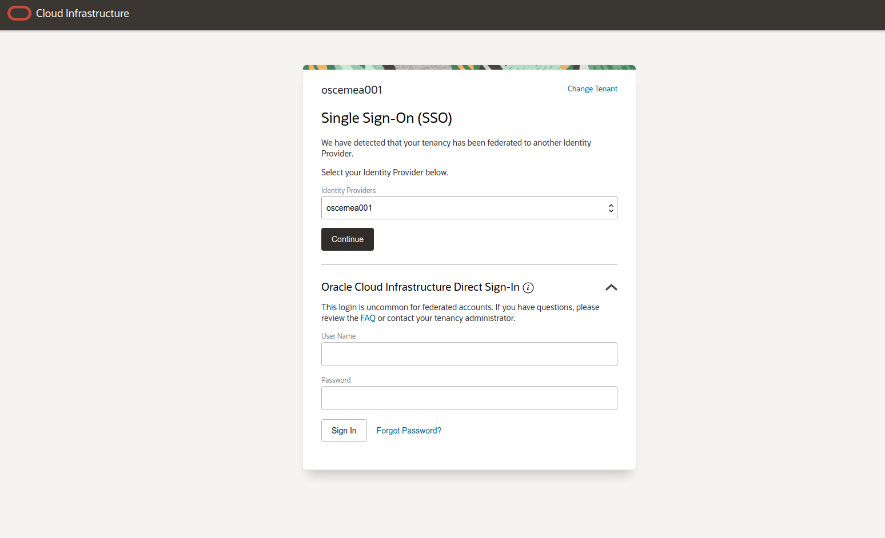

# Coherence on OKE Hands On Lab - Monitoring with Grafana

## Objective

This lab will show the basics of monitoring a Coherence cluster running on OKE with the defacto cloud native monitoring stack of Prometheus and Grafana. It will show the inbuilt features of the Coherence Operator that allow quick and easy integration with the Grafana as well as a rich set of pre-built dashboards that provide feedback on every aspect of your Coherence cluster. 

## Requirements

This lab builds upon the first lab and requires you to have successfully set up two Coherence clusters in OKE. 

Name of the OCI tenancy used to host the lab. This will be supplied in the student guide.

The OCI compartment where your resources will be located. This will be supplied in the student guide.

A username and password for the OCI tenancy used for the lab. The username will be supplied in the student guide. In the first lab you will have chnaged your password, hopefully you can remeber this! 

Details of the two Oracle Container Engine (OKE) clusters that will be used for the lab. 


## Login in to the OCI Console

Our first task will be to connect to Oracle's Cloud Infrastructure for the first time and locate the resources we be using throughout the lab.

This lab will use two OKE clusters, one in the Ashburn region and the other in the Phoenix region. We will interact with the OKE clusters via standard Kubernetes tools like [kubectl](https://kubernetes.io/docs/reference/kubectl/overview/) and [helm](https://helm.sh/). Fortunately OCI provides a [Cloud Shell](https://docs.cloud.oracle.com/en-us/iaas/Content/API/Concepts/cloudshellintro.htm) environment with these tools already installed that we can use as a virtual bastion host. 

To get started locate the OCI username and password assigned to you and open the OCI Console at [https://console.us-phoenix-1.oraclecloud.com/](https://console.us-phoenix-1.oraclecloud.com/) and enter the tenancy name. Your username, one time password and tenancy will be listed in the student guide.


Then expand the down arrow to the right of “Oracle Cloud Infrastructure Direct Sign-In”:


This will reveal the OCI IAM native user log in form:



Enter the username and password provided to you:

Press sign in. 


## Prepare the Ashburn Cluster for Grafana and Prometheus

We will deploy the Grafana and Prometheus stack to the Ashburn kubernetes cluster using the prometheus-community helm chart. Open the cloud shell and ensure you are using the Ashburn context.

First press the "Launch Cloud Shell" button at the top of the OCI console, after a few moments a terminal will launch at the bottom of your browser window. 

**Ensure that you are using the Ashburn context in kubectl!!!**

```
$ kubectl config use-context ash
```

Add the prometheus community helm chart:

```
helm repo add prometheus-community https://prometheus-community.github.io/helm-charts
```

Get the latest version:

```
helm repo update
```

And install the prometheus grafana stack into our cluster:

```
helm install prometheus-stack prometheus-community/kube-prometheus-stack -n coherence-demo-ns --set prometheus.prometheusSpec.serviceMonitorSelectorNilUsesHelmValues=false
```

Check the stack is running OK:

```
kubectl --namespace default get pods -l "release=prometheus-stack" -n coherence-demo-ns
```

The pods should be in the ready state.


## Access the Grafana Web Console

To access the Grafana web console it's necessary to expose it's internal, ClusterIP service as a NodePort service that is reachable from your desktop browser. Run the following command:

```
kubectl patch svc prometheus-stack-grafana -n coherence-demo-ns --type='json' -p '[{"op":"replace","path":"/spec/type","value":"NodePort"}]'
```

NB Changing the service type from ClusterIP to NodePort suits the purposes of this hands on. Note there are other methods to access the Grafana console!!

Get the details of the service, specifically it's port number which is open on all the Kubernetes cluster's worker nodes:

```
kubectl get service prometheus-stack-grafana -o wide -n coherence-demo-ns
```

The service's port number will be listed, it will be a number between 30000 - 32767. Take note of it. 

Obtain one of the worker node's external IP address:

```
kubectl get nodes -owide
```

Make a note of any of the IPs listed in the EXTERNAL-IP column. 

Open a browser and enter the following address http://EXTERNAL-IP:NODE-PORT , substituting the values found above. The log in page for Grafana should appear:


Log in with the default username of **admin** and password of **prom-operator**

The "Welcome to Grafana" panel will open:


The default installation enables monitoring of the Kubernetes cluster itself and the OCI virtual machines that serve as the worker nodes. A set of dashboards is pre-installed to allow you to visualise the metrics that Prometheus is collecting from the Kubernetes cluster. Take a moment to explore them, either via the links in the bottom left pane or via the manage dashboards menu in the left hand side menu. 


For example the overall compute resources for the Kubernetes cluster are visualised like this:


## Access Coherence Metrics in Grafana

We will now configure Prometheus and Grafana to display metrics from our Coherence cluster in Ashburn in addition to those vanilla Kubernetes ones already shown. 

### Install Coherence Dashboards

A set of ready made Coherence dashboards are available for use with Grafana. Download then in your cloud shell environment:

```
curl https://oracle.github.io/coherence-operator/dashboards/latest/coherence-dashboards.tar.gz -o ~/coherence-dashboards.tar.gz
```

And untar them with the following command:

```
tar -zxvf ~/coherence-dashboards.tar.gz
```

Then:

```
cd ~/dashboards/grafana
```

Then install the dashboards as a configmap in with:

```
kubectl -n coherence-demo-ns create configmap coherence-grafana-dashboards --from-file=.
```

Then label the dashboard configmap so that Grafana will register it and display them:

```
kubectl -n coherence-demo-ns label configmap coherence-grafana-dashboards grafana_dashboard=1
```

Swap back to  the Grafana UI and after a few moments you should see the new Coherence dashboards appearing. At the moment they will have no data so don't be concerned if they're empty.


Further details on working with the Coherence Dashboards can be found here - https://oracle.github.io/coherence-operator/docs/latest/#/metrics/030_importing

### Redeploy the Coherence Cluster

The Coherence operator's prometheus and grafana integration requires the Kubernetes cluster to be prepared with the Prometheus operator before creating a Coherence cluster. In the first workshop we already deployed our Coherence clusters so we will solve this chicken & egg issue by redeploying the Ashburn cluster. In reality a Kuberentes cluster will be prepared with all the required supporting utilities, like the monitoring stack, before an application is deployed.

**Ensure that the environment variables are still valid, if cloud shell times out they will be lost.** The following command should return **two** IP addresses:

```
env | grep CLUSTER_HOST
PRIMARY_CLUSTER_HOST=111.99.111.89
SECONDARY_CLUSTER_HOST=111.66.111.44
```

If your cloud shell environment has timed out and reconnected the values may have been lost. To reinstate them issue the following commands:

```
kubectl config use-context phx

export SECONDARY_CLUSTER_HOST=$(kubectl get nodes -owide --no-headers=true | awk {'print $7'} | head -n1)

kubectl config use-context ash

export PRIMARY_CLUSTER_HOST=$(kubectl get nodes -owide --no-headers=true | awk {'print $7'} | head -n1)
```

Ensure you are using the Ashburn kubectl context:

```
kubectl config use-context ash
```

List the helm releases:

```
helm ls -n coherence-demo-ns
NAME                    NAMESPACE               REVISION        UPDATED                                 STATUS          CHART                              APP VERSION
coherence-operator      coherence-demo-ns       1               2021-07-23 09:53:30.425040872 +0000 UTC deployed        coherence-operator-3.1.1           3.1.1      
primary-cluster         coherence-demo-ns       1               2021-07-28 16:32:54.634008235 +0000 UTC deployed        primary-cluster-chart-0.1.0        1.16.0     
prometheus-stack        coherence-demo-ns       1               2021-07-28 16:25:50.484065941 +0000 UTC deployed        kube-prometheus-stack-17.0.2       0.49.0     
```

Delete the primary-cluster release:

```
helm delete primary-cluster -n coherence-demo-ns
release "primary-cluster" uninstalled
```

Wait a few moments for the NodePorts to be released and then, redeploy the Coherence application:

```
cd ~/coherence-demo
```

then

```
helm install primary-cluster --set primaryclusterhost=$PRIMARY_CLUSTER_HOST --set secondaryclusterhost=$SECONDARY_CLUSTER_HOST --set replicas=2 ./primary-cluster-chart/ -n coherence-demo-ns
```


### Check ServiceMonitors

The service monitors for each Coherence cluster are created automatically by the Coherence operator for each cluster so long as metrics are enabled in the Coherence CRD and the Kubernetes cluster is prepared with the Prometheus operator **before** the Coherence cluster is created.  

Check this is so in the cluster we have in Ashburn by describing the two Coherence CRDs we have:

```
kubectl describe coherence  -n coherence-demo-ns
```

Look for the Service Monitor attribute and metrics port in each Coherence CRD. E.g:

```yaml
Ports:
    Name:  http
    Port:  8080
    Name:  metrics
    Port:  9612
    Service Monitor:
      Bearer Token Secret:
        Key:    
      Enabled:  true
```

You can also see the service monitors created as a result:

```
kubectl get servicemonitor -n coherence-demo-ns -l coherenceComponent=coherence-service-monitor
```

You should see two service monitors both labelled with coherenceComponent=coherence-service-monitor as we have two Coherence CRDs representing the http and storage roles in our cluster. Each service monitor tells Prometheus which pods to scrape for metrics. 

Further details on how Coherence on Kubernetes publishes metrics can be found here - https://oracle.github.io/coherence-operator/docs/latest/#/metrics/020_metrics


## Access the Coherence Dashboards

The Coherence Dashboards should now be populated with metrics. Select the Manage Dashboards screen and select the Coherence Dashboard Main, you should see it populated with data and be able to click through to other Coherence components such as machines and cluster members. 


The dashboards are described here - https://oracle.github.io/coherence-operator/docs/latest/#/metrics/040_dashboards


