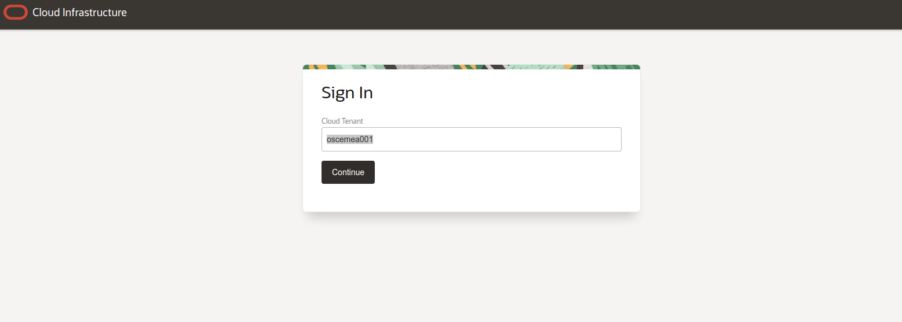
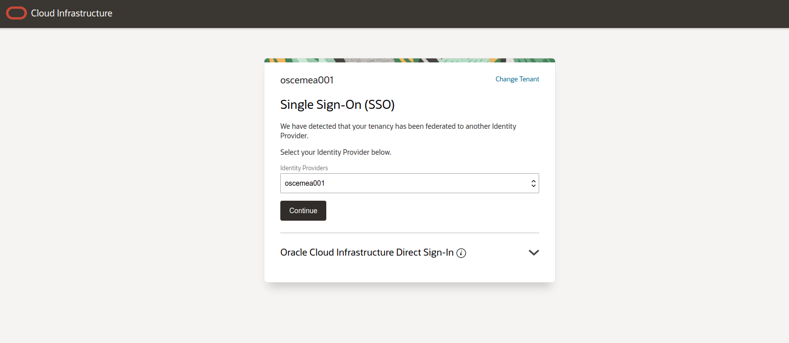
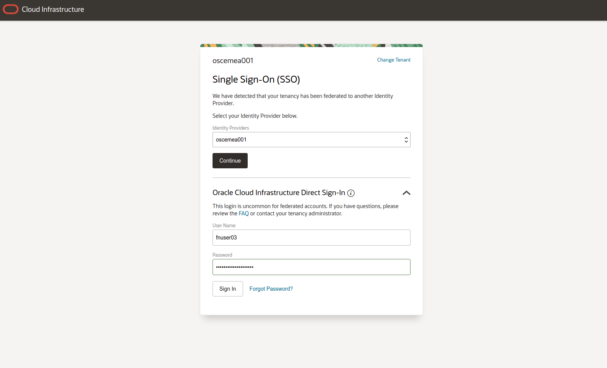
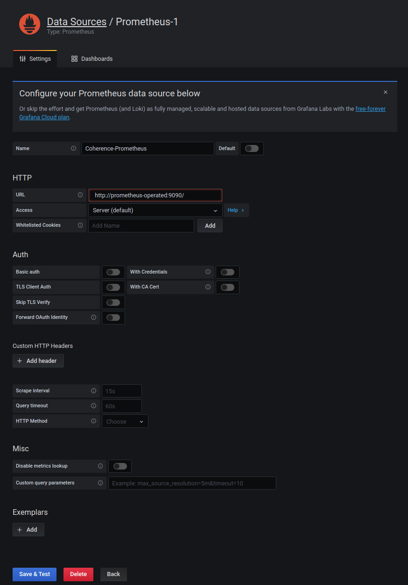

# Coherence on OKE Hands On Lab - Monitoring with Grafana

## Objective

This lab will show the basics of monitoring a Coherence cluster running on OKE with the defacto cloud native monitoring stack of Prometheus and Grafana. It will show the inbuilt features of the Coherence Operator that allow quick and easy integration with the Grafana as well as a rich set of pre-built dashboards that provide feedback on every aspect of your Coherence cluster. 

## Requirements

This lab builds upon the first lab and requires you to have successfully set up two Coherence clusters in OKE. 

Name of the OCI tenancy used to host the lab. This will be supplied in the student guide.

The OCI compartment where your resources will be located. This will be supplied in the student guide.

A username and password for the OCI tenancy used for the lab. The username will be supplied in the student guide. In the first lab you will have chnaged your password, hopefully you can remeber this! 

Details of the two Oracle Container Engine (OKE) clusters that will be used for the lab. 


## Login in to the OCI Console

Our first task will be to connect to Oracle's Cloud Infrastructure for the first time and locate the resources we be using throughout the lab.

This lab will use two OKE clusters, one in the Ashburn region and the other in the Phoenix region. We will interact with the OKE clusters via standard Kubernetes tools like [kubectl](https://kubernetes.io/docs/reference/kubectl/overview/) and [helm](https://helm.sh/). Fortunately OCI provides a [Cloud Shell](https://docs.cloud.oracle.com/en-us/iaas/Content/API/Concepts/cloudshellintro.htm) environment with these tools already installed that we can use as a virtual bastion host. 

To get started locate the OCI username and password assigned to you and open the OCI Console at [https://console.us-phoenix-1.oraclecloud.com/](https://console.us-phoenix-1.oraclecloud.com/) and enter the tenancy name. Your username, one time password and tenancy will be listed in the student guide.



Then expand the down arrow to the right of “Oracle Cloud Infrastructure Direct Sign-In”:



This will reveal the OCI IAM native user log in form:


Enter the username and password provided to you:

Press sign in. 


## Prepare the Ashburn Cluster for Grafana and Prometheus

We will deploy the Grafana and Prometheus stack to the Ashburn kubernetes cluster using the prometheus-community helm chart. Open the cloud shell and ensure you are using the Ashburn context.

First press the "Launch Cloud Shell" button at the top of the OCI console, after a few moments a terminal will launch at the bottom of your browser window. 

**Ensure that you are using the Ashburn context in kubectl!!!**

```
$ kubectl config use-context ash
```

Add the prometheus community helm chart:

```
helm repo add prometheus-community https://prometheus-community.github.io/helm-charts
```

Get the latest version:

```
helm repo update
```

And install the prometheus grafana stack into our cluster:

```
helm install prometheus-stack prometheus-community/kube-prometheus-stack -n coherence-demo-ns
```

Check the stack is running OK:

```
kubectl --namespace default get pods -l "release=prometheus-stack" -n coherence-demo-ns
```

The pods should be in the ready state.


## Access the Grafana Web Console

To access the Grafana web console it's necessary to expose it's internal, ClusterIP service as a NodePort service that is reachable from your desktop browser. Run the following command:

```
kubectl patch svc prometheus-stack-grafana -n coherence-demo-ns --type='json' -p '[{"op":"replace","path":"/spec/type","value":"NodePort"}]'
```

NB Changing the service type from ClusterIP to NodePort suits the purposes of this hands on. Note there are other methods to access the Grafana console!!

Get the details of the service, specifically it's port number which is open on all the Kubernetes cluster's worker nodes:

```
kubectl get service prometheus-stack-grafana -o wide -n coherence-demo-ns
```

The service's port number will be listed, it will be a number between 30000 - 32767. Take note of it. 

Obtain one of the worker node's external IP address:

```
kubectl get nodes -owide
```

Make a note of any of the IPs listed in the EXTERNAL-IP column. 

Open a browser and enter the following address http://EXTERNAL-IP:NODE-PORT , substituting the values found above. The log in page for Grafana should appear:


Log in with the default username of **admin** and password of **prom-operator**

The "Welcome to Grafana" panel will open:


The default installation enables monitoring of the Kubernetes cluster itself and the OCI virtual machines that serve as the worker nodes. S et of dashboards are pre-installed to allow you to visualise the metrics that Prometheus is collecting. Take a moment to explore them either via the links in the bottom left pane or via the manage dashboards menu in the left hand side menu. 


For example the overall compute resources for the Kubernetes cluster are visualised like this:


## Access Coherence Metrics in Grafana

We will now configure Prometheus and Grafana to display metrics from our Coherence cluster in Ashburn in addition to those vanilla Kubernetes ones already shown. 

### Install Coherence Dashboards

A set of ready made Coherence dashboards are available for use with Grafana. Download then in your cloud shell environment:

```
curl https://oracle.github.io/coherence-operator/dashboards/latest/coherence-dashboards.tar.gz -o coherence-dashboards.tar.gz
```

And untar them with the following command:

```
tar -zxvf coherence-dashboards.tar.gz
```

As we have already have a working set of dashboards pulling metrics from a Prometheus endpoint we'll modify the new Coherence dashboards to work with a new Prometheus endpoint we'll create in the next step. Modify the dashboard definitions with the following two commands. First:

```
cd ~/dashboards/grafana
```

and then:

```
for file in *.json
do
    sed -i '' -e 's/"datasource": "Prometheus"/"datasource": "Coherence-Prometheus"/g' \
              -e 's/"datasource": null/"datasource": "Coherence-Prometheus"/g' \
              -e 's/"datasource": "-- Grafana --"/"datasource": "Coherence-Prometheus"/g' $file;
done
```

Then install the dashboards as a configmap in with:

```
kubectl -n coherence-demo-ns create configmap coherence-grafana-dashboards --from-file=.
```

Then label the dashboard configmap so that Grafana will register it:

```
kubectl -n coherence-demo-ns label configmap coherence-grafana-dashboards grafana_dashboard=1
```

Swap back to  the Grafana UI and after a few moments you should see the new Coherence dashboards appearing. At the moment they will have no data so don't be concerned if they're empty.


Further details on working with the Coherence Dashboards can be found here - https://oracle.github.io/coherence-operator/docs/latest/#/metrics/030_importing

### Create a new Prometheus End Point

The Prometheus operator works like the Coherence operator via a set of custom resource definitions (CRDs). We will create a Prometheus CRD that will result in a new Prometheus endpoint that exposes the metrics from all the Coherence clusters in our OKE cluster. In cloud shell issue the following command:

```
cat <<EOF | kubectl apply -n coherence-demo-ns -f -
apiVersion: monitoring.coreos.com/v1
kind: Prometheus
metadata:
  name: prometheus
spec:
  serviceAccountName: prometheus-stack-kube-prom-prometheus
  serviceMonitorSelector:
    matchLabels:
      coherenceComponent: coherence-service-monitor  
  resources:
    requests:
      memory: 400Mi
  enableAdminAPI: true
EOF
```

This will pull all the metrics from the prometheus service monitor components that are labelled with coherenceComponent = coherence-service-monitor. The service monitors for each Coherence cluster are created automatically by the Coherence operator for each cluster so long as metrics is enabled in the Coherence CRD.  

Check this is so in the cluster we have in Ashburn by describing the two Coherence CRDs we have:

```
kubectl describe coherence  -n coherence-demo-ns
```

Look for the Service Monitor attribute and metrics port in each Coherence CRD. E.g:

```yaml
Ports:
    Name:  http
    Port:  8080
    Name:  metrics
    Port:  9612
    Service Monitor:
      Bearer Token Secret:
        Key:    
      Enabled:  true
```

You can also see the service monitors created as a result:

```
kubectl get servicemonitor -n coherence-demo-ns -l coherenceComponent=coherence-service-monitor
```

You should see two service monitors both labelled with coherenceComponent=coherence-service-monitor as we have two Coherence CRDs representing the http and storage roles in our cluster. This label is used in the serviceMonitorSelector of the Prometheus CRD.

The Prometheus operator will create a Stateful Set for the prometheus CRD and also a service to allow other components, like Grafana, to access the metrics. 

```
kubectl get statefulset prometheus-prometheus -n coherence-demo-ns
```

And the service we will use in the Grafana data source we will create in the next step:

```
kubectl get svc prometheus-operated -n coherence-demo-ns
NAME                  TYPE        CLUSTER-IP   EXTERNAL-IP   PORT(S)    AGE
prometheus-operated   ClusterIP   None         <none>        9090/TCP   4d17h
```

Further details on how Coherence on Kubernetes publishes metrics can be found here - https://oracle.github.io/coherence-operator/docs/latest/#/metrics/020_metrics


### Create a new Grafana Data Source

A new Grafana data source will allow specific Coherence metrics to be pushed into the new dashboards created above in parallel to the Kubernetes metrics. In the UI go to the settings cog wheel in the left hand menu pane and select the Data Sources tab :

 


Press the blue "Add data source" button:


Click the top pane which should be labelled "Prometheus" and enter the following information:

- Name: Coherence-Prometheus
- URL:   http://prometheus-operated:9090/

Leave all other fields at their default. The screen should look like this:



Scroll to the bottom of the screen and press "Save & Test". You should see confirmation that the data source is working OK. 


## Access the Coherence Dashboards

The Coherence Dashboards should now be populated with metrics. 

The dashboards are described here - https://oracle.github.io/coherence-operator/docs/latest/#/metrics/040_dashboards


